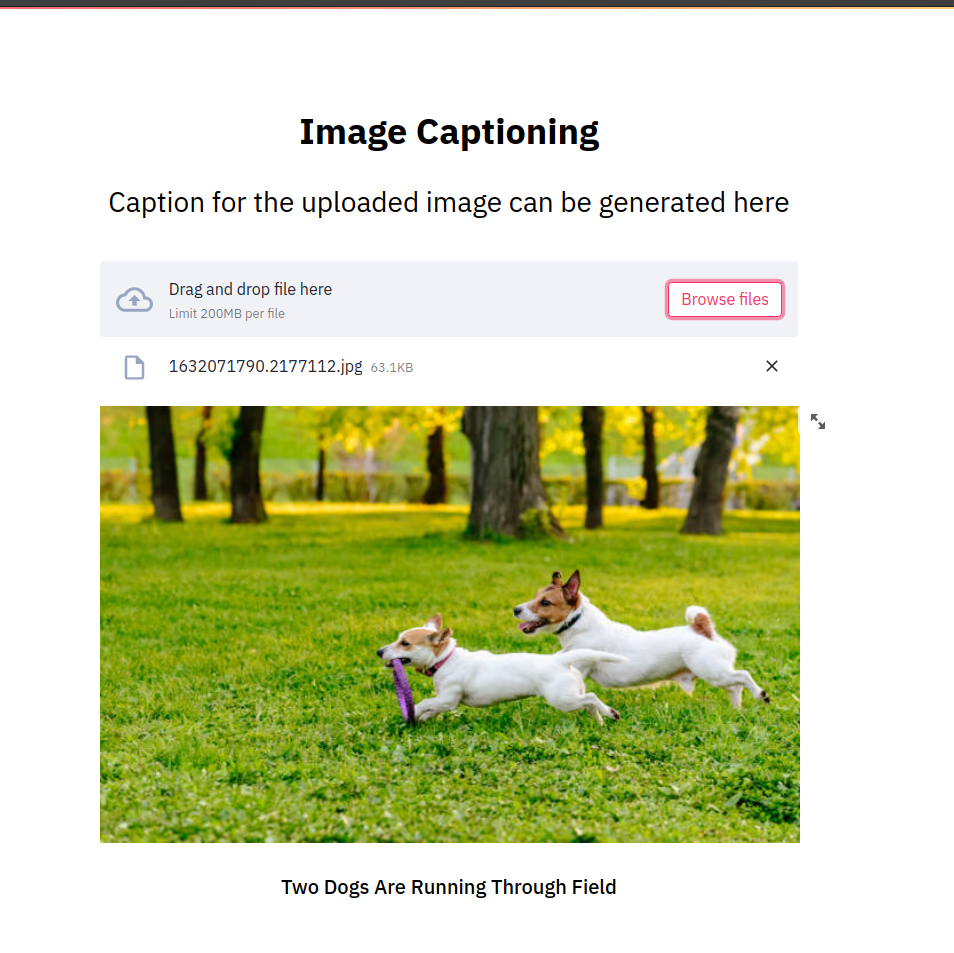
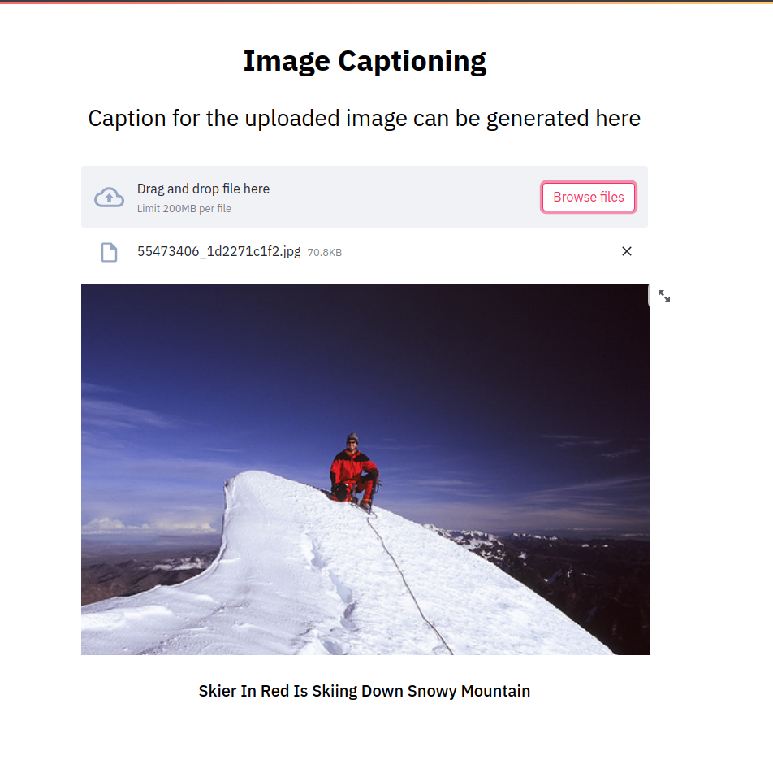

# Image_Captioning

This repository contains implementation of a image captioning system. This system takes as input a image and generates a caption describing about the image.

The objective is to build a model of Image caption generator using CNN and LSTM, converts the trained model as API and integrate it with interactive user interface application.


<p align="center">
  
</p>

<p align="center">
	Image Credits : <a href="https://towardsdatascience.com/image-captioning-in-deep-learning-9cd23fb4d8d2">Towardsdatascience</a>
</p>

## Summary of task performed

The caption generator model is trained using the Xception model of CNN [computer vision]  to understand the content of the image and the LSTM model to turn the understanding of the image into words in the right order. The caption on new images is generated using the trained model.

The prediction model API is exposed with swagger document which is ready to use using FastAPI. The user-friendly caption generator feel is designed using Streamlit.  Both the model service and Application UI are containerized using docker. Docker image is stored in the GitLab repo. The docker-compose file provides the orchestration to run the complete application with just one command.

## The final application will be seen as : 

<p align="center">
  
</p>

*Demo (linkedin post)*
## Requirments

*System Requirements*

- Memory : atleast 8 GB
- RAM : 8 GB or more
- Active internet connection so that keras can download xception model weights

**Dataset** : <a href="https://forms.illinois.edu/sec/1713398">Dataset Request Form</a>

<strong>UPDATE (April/2019):</strong> The official site seems to have been taken down (although the form still works). Here are some direct download links:

<ul type="square">
	<li><a href="https://github.com/jbrownlee/Datasets/releases/download/Flickr8k/Flickr8k_Dataset.zip">Flickr8k_Dataset</a></li>
	<li><a href="https://github.com/jbrownlee/Datasets/releases/download/Flickr8k/Flickr8k_text.zip">Flickr8k_text</a></li>
	Download Link Credits:<a href="https://machinelearningmastery.com/develop-a-deep-learning-caption-generation-model-in-python/"> Jason Brownlee</a>
</ul>

**Docker**
**Install Compose**

## Procedure to use the above application on the local system : 

**Clone the repository :**

<div class="termy"> 

```console
$ git clone https://gitlab.com/tanya_ranjan/image_captioning.git
```
</div>

**Run it**
```console
$ cd image_captioning

$ docker_compose up


Starting backend ... done
Starting frontend ... done
Attaching to backend, frontend
backend     | INFO:     Uvicorn running on http://0.0.0.0:5000 (Press CTRL+C to quit)
backend     | INFO:     Started parent process [1]
backend     | prod
frontend    |   You can now view your Streamlit app in your browser.
frontend    | 
frontend    |   Network URL: http://172.20.0.3:8501
frontend    |   External URL: http://157.35.45.151:8501
```
</div>

**Check it**

Open your browser at <a href="http://172.20.0.3:8501" class="external-link" target="_blank">http://172.20.0.3:8501</a>.

<p align="center">
  
</p>

## Procedure to build the model application from scratch - 
### Train the model : 

1. Clone the repository : 

<div class="termy"> 

```console
$ git clone https://gitlab.com/tanya_ranjan/image_captioning.git
```
</div>


2. Download the require dataset files.

3. Go to service folder of downloaded directory and install the required python packages :

<div class="termy">

```console
$ cd image_captioning/services

$ pip install -r requirements.txt
```
</div>

4. Run `services/notebooks/training_caption_generator.ipynb`


# UI  
  *Designed using streamlit*

Streamlit is an open-source Python library that makes it easy to create and share beautiful, custom web apps for machine learning and data science. In just a few minutes you can build and deploy powerful data apps 

[Link to refer](https://docs.streamlit.io/en/stable/)

# Services
  Service Api are expose on FastApi

FastAPI is a modern, high-performance web framework for building APIs with Python based on standard type hints. 
The framework is designed to optimize your developer experience so that you can write simple code to build production-ready APIs with best practices by default.
[link to refer](https://fastapi.tiangolo.com/)

### Docker Conatiner for ui and services

- push docker frontend backened images in gitlab
- use that image as docker container

- curl https://gitlab.com/tanya_ranjan/image_captioning/-/raw/main/docker-compose.yml > docker-compose.yml

- docker-compose up -d


- sudo apt install docker.io
- sudo apt install docker-compose
- git clone <https......>
- sudo docker-compose up -d
